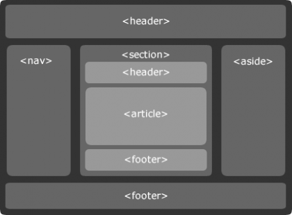
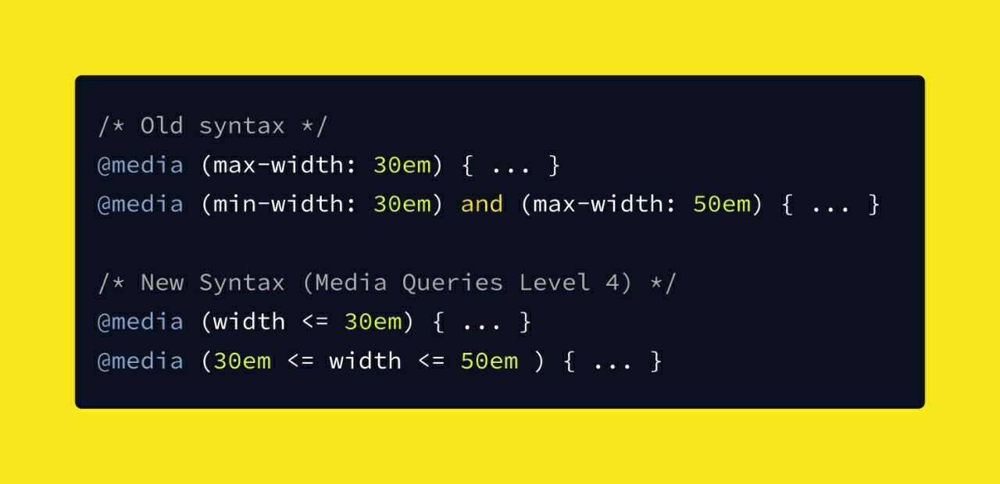
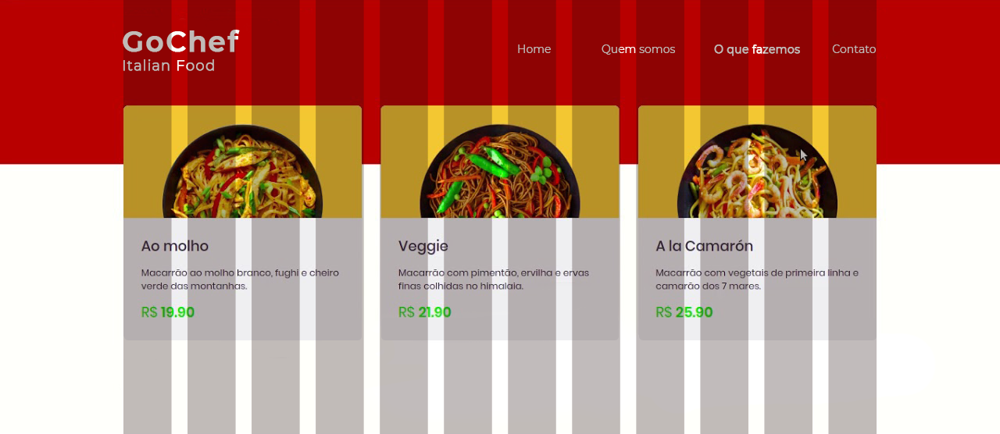

#### Cursos

```js
// (1) HTML5
// Curso Completo de HTML5 (42 aulas)
// https://goo.gl/SD4p4g
// Curso Aprenda HTML em 1 hora (22 aulas)
// https://goo.gl/1kfBCZ

// (2) CSS 
// Curso completo de CSS3 (22 aulas)
// https://goo.gl/ebjzVG
// Curso Básico de CSS (12 aulas)
// https://goo.gl/s98HNb

// (3) Bootstrap
// Curso de Bootstrap (16 aulas)
// https://goo.gl/xFDOxT

// (4) JavaScript
// Curso completo de Javascript (46 aulas)
// https://goo.gl/zfjfkQ
```

#### Desafio de HTML #1

```js
// (1) Implemente uma estrutura básica de um site usando HTML 5.
// (utitlize tags <header> <nav> <section> <article> <sidebar> <footer>)
// (construa a nav utilizando as <li> Home, Quem somos, O que fazemos e Contato
// Apenas a estrutura, não precisa de css
// Axilia na estrutura do site
?

```
<p align='center'></p>

```js
// (2) Implemente um formulário de contato em HTML 5. 
// (utilize os campos: nome, email, assunto e mensagem)
// Axilia na página de 'contato'
?

```

#### Desafio de CSS #2

```js
// (1) Desenvolva o css da página sem mexer na estrutura HTML.
// Auxilia no estilo do site
// Para desenvolver: Acesse o link Estrutura HTML fork o repositório, clone o projeto e implemente a landing page.
// Inspirado no curso da Rocketseat
?
```
[Estrutura HTML](https://github.com/DaianeBarizon/ProffysDiscovery) :rocket:

<p align='center'></p>
<p align='center'></p>


```js
// (3) Entre no site do Flexbox Froggy e ajude o Froggy escrevendo código CSS. 
// Auxilia no estudo de Flexbox
```

[Clique Flexbox Froggy](https://flexboxfroggy.com/)

```js
// (4) Pegue o primeiro exercício (Proffy) e deixe o layout responsivo.
// (utilize media queries para fazer a responsividade)
// Auxilia em layout responsivo
```
<p align='center'></p>

#### Desafio de Bootstrap #3

```js
// (1) Implemente o layout abaixo usando bootstrap e css.
// (utilize o máximo possível do css do próprio bootstrap)
// (utilize a fonte https://fonts.google.com/specimen/Montserrat
// (utilize o hexadecimal #b80000 (vermelho) #efeff1 (cinza do card) #48ee34 (verde) #625c68 (cinza escuro)
// Auxilia na página 'o que fazemos'
?
```

<p align='center'></p>
<p align='center'></p>

#### Desafio de JavaScript #4

```js
// (1) Faça um programa que leia a idade de uma pessoa expressa em anos, meses e dias e mostre-a expressa apenas em dias.
?

// (2) A padaria Hotpão vende uma certa quantidade de pães franceses e uma quantidade de broas a cada dia.
// Cada pãozinho custa R$ 0,12 e a broa custa R$ 1,50. Ao final do dia, o dono quer saber quanto arrecadou com a
// venda dos pães e broas (juntos), e quanto deve guardar numa conta de poupança (10% do total arrecadado).
// Você foi contratado para fazer os cálculos para o dono. Com base nestes fatos, faça um algoritmo para ler
// as quantidades de pães e de broas, e depois calcular os dados solicitados.
?

// (3) Faça um programa para calcular a média de 5 alunos e retornar os alunos aprovados em ordem crescente por nota.
// (utilize forEach para percorrer o array)
?

// (4) Faça um programa que entre com cinco números e imprima o quadrado de cada número sem modificar o array inicial.
?

// (5) Crie um array com vários nomes pessoais. Exiba na tela todos os nomes digitados,
// porém de maneira invertida (do último para o primeiro).
?

// (6) Dado o array animais.

`animals = [
  {
    name: 'Butters',
    age: 3,
    type: 'cat'
  },
  {
    name: 'Lizzy',
    age: 6,
    type: 'dog'
  },
  {
    name: 'Red',
    age: 1,
    type: 'cat'
  },
  {
    name: 'Joey',
    age: 3,
    type: 'dog'
  },
];`


// (1) Retorne apenas os nomes dos cachorros. (utilize filter para percorrer o array)
?

// (2) Retorne a soma da idade dos gatos. (utilize reduce para percorrer o array)
?

// Auxiliam na base javaScript e na explicação de alguns métodos auxiliares para array
```
#### Desafio Extra #5

```js
// (1) Implemente uma calculadora utilizando bootstrap, css e javaScript para sua funcionalidade.
// (somente as 4 operações básicas)

// (2) Implemente um carrossel
?

```

#### Curso Extra

```js
// (1) Curso de Less (6 aulas)
// https://goo.gl/Y5UkLQ
// (2) Curso de Sass (18 aulas)(inglês)
// https://goo.gl/DzRv1e
// (3) Curso de CSS3 com Sass e Compass (9 aulas)
// https://goo.gl/bAO0hE
